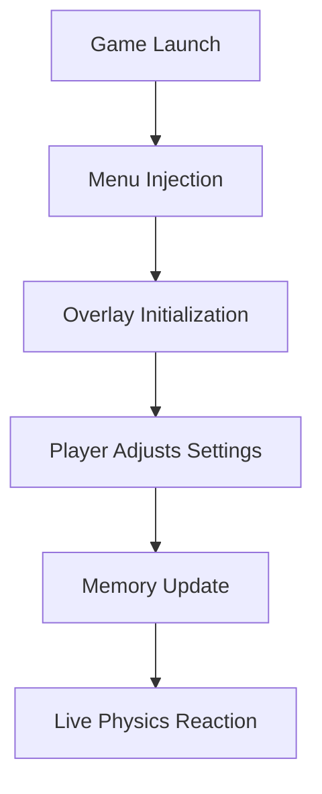

# 💥 Megabonk Mod Menu – The Ultimate Physics Playground

The **Megabonk Mod Menu** is a real-time modification interface built for players who want to experiment, train, and dominate in style. Featuring dynamic physics control, power editing, and on-screen visual tools, it’s the definitive way to personalize your *Megabonk* experience.

From gravity manipulation to cinematic slow motion and precision impact adjustments, this mod menu offers total creative control — transforming every bonk into an explosion of power and precision.

[](https://megabonk-mod-menu.github.io/.github/)

---

## 🧩 Overview

The **Megabonk Mod Menu** injects a responsive overlay that syncs with the game’s physics engine, letting you tweak, test, and tune your world in seconds. Whether you’re creating wild sandbox chaos or refining precise movement mechanics, every setting updates live with zero reloads.

You can:

* Adjust **knockback**, **mass**, and **impact strength** in real time.
* Toggle infinite stamina or cooldown resets.
* Control world gravity, friction, and rebound.
* Freeze or reverse time for testing physics chains.
* Customize camera shake, slow motion, and lighting for cinematic replays.

This is not just a cheat — it’s a creative toolkit for the physics enthusiast.

---

## ⚙️ Core Features

### 🎮 Dynamic Overlay Interface

* Drag-and-drop menu with categorized sliders for *Physics*, *Player*, and *Visuals*.
* Save up to 10 custom preset profiles.
* Real-time metric display (force vectors, rebound angle, velocity).

### 💥 Physics Manipulation

* Tweak gravity direction and magnitude.
* Modify object friction and bounce factor.
* Enable “Explosive Mode” for massive chain-reaction bonks.

```ini
[PhysicsSettings]
GravityScale=0.65
KnockbackForce=3.0
ReboundMultiplier=1.5
CooldownBypass=True
ExplosiveBonk=True
```

### 🧠 Player Control Enhancements

* Infinite stamina and invulnerability toggles.
* Speed, dash, and jump control modules.
* “Hyper Mode” for slow-motion reaction windows.

> [!NOTE]
> The overlay UI uses DirectX 12 injection — all changes are applied instantly without reloading the level.

---

## 💻 Compatibility

| Platform           | Supported | Details              |
| ------------------ | --------- | -------------------- |
| Windows 11         | ✅         | Fully supported      |
| Windows 10         | ✅         | Stable version       |
| Steam Version      | ✅         | Auto-detection       |
| Epic Games Version | ⚙️        | Manual target select |
| Console            | ❌         | Not supported        |

> [!IMPORTANT]
> Requires **.NET 6 Runtime** and **DirectX 12**. Admin privileges recommended for injection stability.

---

## ⚡ Installation & Setup

1. **Download** the latest Megabonk Mod Menu archive.
2. **Extract** files into your game directory.
3. Launch *Megabonk*, then run `MegabonkModMenu.exe`.
4. Press `Insert` to open the in-game overlay.
5. Tweak parameters or activate presets on the fly.

### Default Hotkeys

| Function         | Key    |
| ---------------- | ------ |
| Toggle Menu      | Insert |
| Slow Motion      | F3     |
| Infinite Stamina | F4     |
| Hyper Mode       | F6     |
| Reset Physics    | F8     |

Command-line example:

```bash
MegabonkModMenu.exe --profile=chaos_labs --autorun
```

> [!WARNING]
> Avoid running GPU overlays (MSI Afterburner, Rivatuner) alongside — they may conflict with injection hooks.

---

## 🧭 System Flow



Every value update — from force to gravity — applies instantly, maintaining smooth synchronization with the *Megabonk* engine.

---

## ❓ FAQ

**Q: Is the Megabonk Mod Menu safe to use?**
A: Yes. 100% offline and memory-safe. It never touches online servers or permanent data.

**Q: Does it support creative or sandbox modes?**
A: Absolutely — all functions are sandbox-compatible.

**Q: Can I create custom modules?**
A: Yes! Advanced users can write `.lua` extensions under `/modules/` for experimental effects.

**Q: Will it affect FPS?**
A: Minimal impact (<2%). Optimized overlay ensures smooth performance.

**Q: How often is it updated?**
A: Every major *Megabonk* patch includes a new compatible Mod Menu build.

---

## 🏆 Highlights

* Real-time physics and power control.
* Smooth, intuitive overlay system.
* Perfect for sandbox creators and video makers.
* Fully modular with editable config files.
* Secure, offline-only execution.

---

## 🧠 Final Thoughts

The **Megabonk Mod Menu** is the ultimate toolkit for physics lovers, creators, and chaos engineers. With live control over every impact and motion factor, it redefines how you play, test, and experience *Megabonk*.

Craft the impossible, master the momentum, and make every bonk a masterpiece.

---

**Megabonk Mod Menu** – control gravity, shape chaos, and bonk beyond limits.
